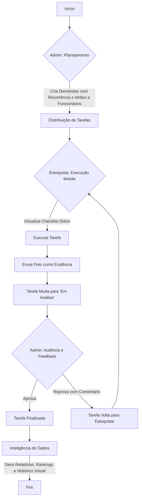

# Fiscalizei

O **Fiscalizei** é uma plataforma de gestão de **trade marketing** e **merchandising** projetada para otimizar a eficiência operacional em redes atacadistas. O sistema substitui a supervisão subjetiva por uma gestão baseada em evidências, conectando gestores (**Administradores**) aos funcionários no campo (**Estoquistas**) em tempo real.

A plataforma utiliza **Java com Spring Boot** no backend e **HTML/CSS/JavaScript** no frontend (com abordagem **mobile-first**), permitindo a **criação, distribuição, execução e auditoria** de tarefas diárias, semanais ou mensais, com comprovação por **fotos**.

---

## Resumo Executivo

O Fiscalizei transforma o controle de atividades de merchandising em um processo **digital, transparente e mensurável**.

### Funcionamento principal

1. **Planejamento (Admin)**  
   O Administrador define tarefas via painel web, configurando recorrência (diária, semanal, mensal) e atribuindo a funcionários ou setores.

2. **Execução Mobile (Estoquista)**  
   Estoquistas acessam via celular, visualizam checklist de tarefas pendentes, executam e enviam **foto** como prova de conclusão.

3. **Auditoria e Feedback (Admin)**  
   Administradores analisam **fotos + horário**, aprovam ou reprovam (com comentário). Tarefas reprovadas voltam imediatamente para o estoquista.

4. **Inteligência de Dados**  
   Gera relatórios de produtividade, ranking por funcionário, áreas com maior índice de reprovação e histórico visual (fotos) da loja.

---

## Tecnologias

### Backend
- Java 17+
- Spring Boot 3.x (Web, Data JPA, Security)
- PostgreSQL (ou MySQL)
- Maven
- Lombok, Hibernate, JWT

### Frontend
- HTML5, CSS3, JavaScript (ES6+)
- Bootstrap 5 (responsividade)
- Axios (chamadas API)
- Chart.js (gráficos de relatórios – opcional)

### Outros
- Git
- Armazenamento de imagens (filesystem local ou AWS S3)
- Autenticação JWT

---

## Fluxo principal do sistema



---

## Requisitos Funcionais

- **RF01:** Administrador cria tarefas com descrição, recorrência e atribuição  
- **RF02:** Estoquista visualiza e conclui tarefas com upload de foto  
- **RF03:** Administrador aprova/reprova tarefas com feedback  
- **RF04:** Geração de relatórios (ranking, reprovações, histórico)  
- **RF05:** Autenticação e autorização (Admin × Estoquista)  
- **RF06:** Notificações em tempo real (novas tarefas / reprovações)  
- **RF07:** Armazenamento e exibição de fotos com timestamp  

---

## Requisitos Não Funcionais

- Resposta de API < 2 segundos  
- Suporte inicial: até 100 usuários simultâneos  
- Interface responsiva (mobile-first para estoquistas)  
- Segurança: JWT, hash de senhas, validação de uploads  
- Compatibilidade: navegadores modernos + Android/iOS via navegador  

---

## Estrutura do Projeto

### Backend (Spring Boot)

```text
fiscalizei-backend/
├── src/
│   ├── main/
│   │   ├── java/com/fiscalizei/
│   │   │   ├── controller/     # REST Controllers
│   │   │   ├── service/        # Regras de negócio
│   │   │   ├── repository/     # JPA Repositories
│   │   │   ├── model/          # Entidades JPA
│   │   │   ├── config/         # Security, WebSocket, etc.
│   │   │   └── FiscalizeiApplication.java
│   │   └── resources/
│   │       ├── application.properties
│   │       └── static/         # (opcional)
│   └── test/
├── pom.xml
└── README.md
```

### Frontend

```text
fiscalizei-frontend/
├── admin/                      # Painel Administrador
│   ├── index.html
│   ├── css/
│   └── js/
├── estoquista/                 # Interface Mobile Estoquista
│   ├── index.html
│   ├── css/
│   └── js/
├── shared/                     # Arquivos comuns
│   ├── css/global.css
│   └── js/utils.js             # Funções de API, auth, etc.
└── README.md
```

---

## Modelos de Dados (Entidades)

### Usuario
- id (PK)
- nome
- email
- senha (hash)
- role (ADMIN / ESTOQUISTA)
- setor (opcional)

### Tarefa
- id (PK)
- descricao
- recorrencia (DIARIA / SEMANAL / MENSAL)
- dataCriacao
- status (PENDENTE / EM_ANALISE / APROVADA / REPROVADA)
- usuarioAtribuido (FK)
- adminCriador (FK)

### Evidencia
- id (PK)
- tarefa (FK)
- fotoUrl
- timestamp
- comentario (feedback do admin)

---

## Principais Endpoints da API

**Base:** `/api/v1`

### Autenticação
- `POST /auth/login` → `{ email, senha }` → **JWT**

### Tarefas (Admin)
- `POST /tarefas`
- `GET /tarefas`
- `PUT /tarefas`
- `PUT /tarefas/{id}/aprovar`
- `PUT /tarefas/{id}/reprovar`

### Tarefas (Estoquista)
- `GET /tarefas/minhas`
- `POST /tarefas/{id}/evidencia` *(multipart/form-data com foto)*

### Relatórios
- `GET /relatorios/ranking`
- `GET /relatorios/historico`
